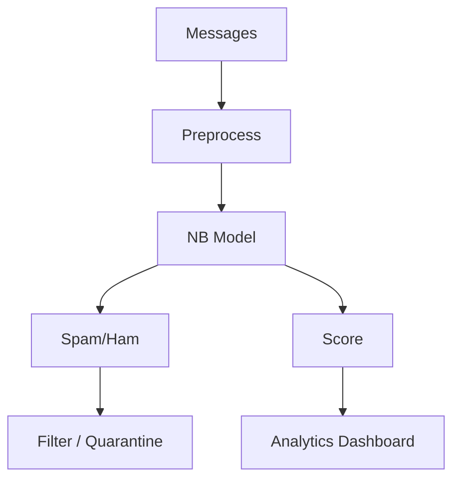

# Operationalization: Spam Filter API

## Architecture

## Target user and value proposition

**Target users:** Product teams operating SMS or email gateways; developers who need a lightweight, interpretable spam classifier for in-app messaging or support queues.

**Value proposition:** Classify incoming messages with a spam/ham label and an optional confidence score; integrate with existing filter or quarantine logic. Low latency and small footprint (no GPU) make it suitable for edge or high-throughput APIs.

**Deployment:** Run the trained model behind a REST API (e.g. FastAPI or Flask): POST a message body, return `{"label": "spam"|"ham", "score": float}`. Optionally persist scores for an analytics dashboard (volume of spam over time, threshold tuning). Scale via load balancer and optional async queue for batch classification.

## Next steps

1. **Add FastAPI wrapper:** Expose `run.py` logic as a single endpoint (e.g. `/classify`) with request/response schemas and health check.
2. **Dockerize:** Build a container that installs dependencies and runs the API; document how to mount the serialized vectorizer and model (e.g. joblib) or retrain on startup.
3. **Add auth and rate limiting:** If the API is multi-tenant, add API-key or OAuth and rate limits; log predictions for auditing and threshold tuning.
