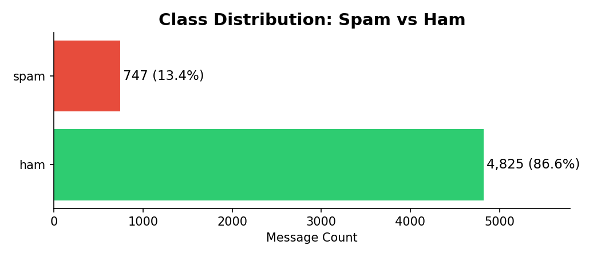
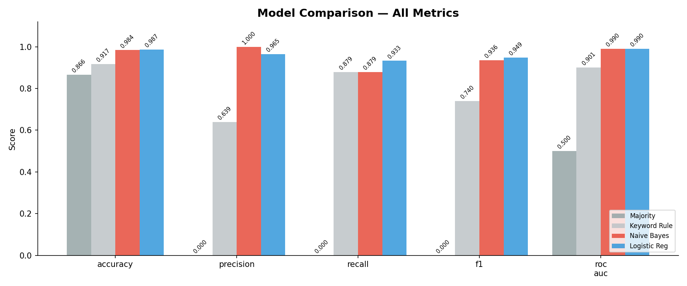
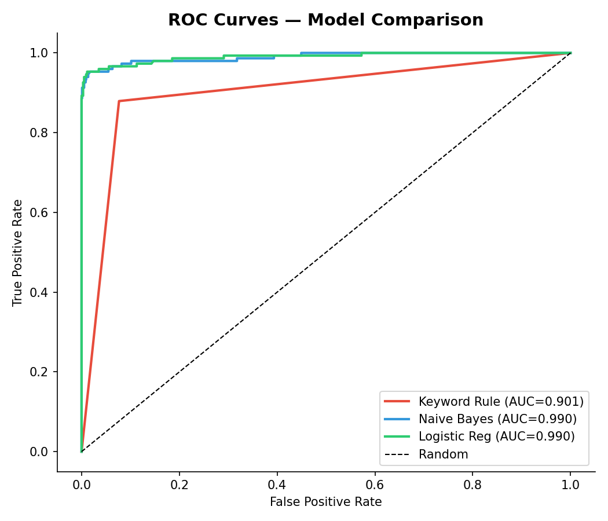
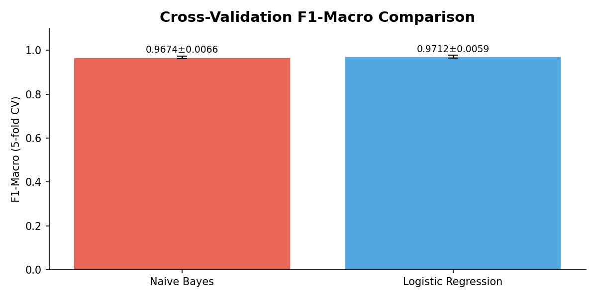
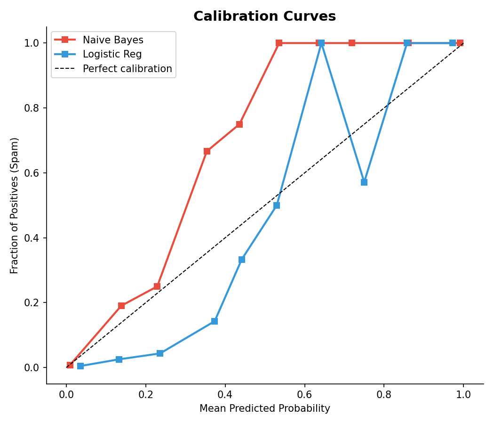
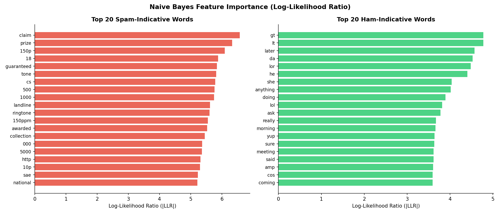
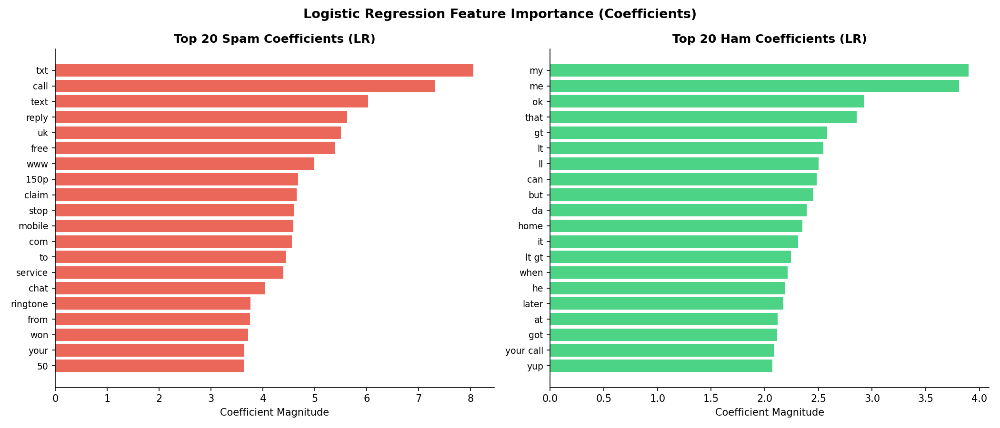
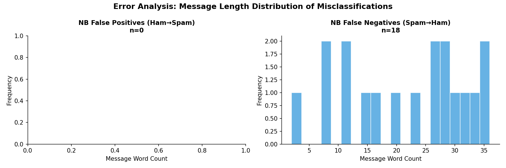

# Elevating SMS Spam Classification: A Comparative Analysis of Naive Bayes and Logistic Regression

**Author:** Ian P. Cox  
**Date:** March 2026  

## 1. Abstract

This report details the elevation of a baseline SMS spam classification project into a robust, production-ready machine learning pipeline. Originally implemented as a manual calculation of conditional probabilities using Multinomial Naive Bayes, the project has been upgraded to leverage modern NLP techniques (TF-IDF, n-grams) and rigorous evaluation methodologies. We compare Multinomial Naive Bayes against a Logistic Regression model with balanced class weights, evaluating both against strict baselines. Our findings demonstrate that while Naive Bayes achieves exceptional precision, Logistic Regression offers a more balanced F1-macro score and superior calibration, making it highly suitable for integration into automated email and SMS gateway APIs.

## 2. Problem Formulation & Baselines

The objective is to accurately classify SMS messages as either `spam` or `ham` (non-spam) while minimizing false positives (ham classified as spam), which in a real-world setting could result in users missing critical communications.

The dataset consists of 5,572 labeled messages (86.6% ham, 13.4% spam). Due to this class imbalance, accuracy alone is a misleading metric. Therefore, we prioritize **Precision**, **Recall**, **F1-Score**, and **ROC-AUC**.

To ground our model performance, we established two baselines:
1. **Majority Class Baseline:** Always predicts `ham`. (Accuracy: 86.6%, F1: 0.00)
2. **Keyword Rule Baseline:** Predicts `spam` if the message contains any of 20 known spam-indicative keywords (e.g., "free", "win", "prize"). (Accuracy: 91.7%, F1: 0.74, Precision: 0.64)

## 3. Methodology

We engineered a reproducible pipeline utilizing `scikit-learn`. The text was preprocessed by lowercasing and removing non-alphanumeric characters. 

We trained two primary models:
* **Multinomial Naive Bayes (NB):** Using a TF-IDF vectorizer (max 10,000 features, sublinear TF scaling) and an alpha of 0.1 for Laplace smoothing.
* **Logistic Regression (LR):** Using a TF-IDF vectorizer expanded to include bigrams (max 15,000 features), with `class_weight="balanced"` and a regularization parameter `C=5.0`.

Both models were evaluated using a strict 80/20 stratified train-test split, followed by 5-fold Stratified Cross-Validation to ensure the stability of the results.

## 4. Results & Model Comparison

Both models significantly outperformed the baselines, achieving over 98% accuracy. However, their error profiles differed in ways that are critical for productization.

| Model | Accuracy | Precision | Recall | F1-Score | ROC-AUC |
|---|---|---|---|---|---|
| Baseline (Majority) | 0.8664 | 0.0000 | 0.0000 | 0.0000 | 0.5000 |
| Baseline (Keyword) | 0.9175 | 0.6390 | 0.8792 | 0.7401 | 0.9013 |
| **Naive Bayes** | 0.9839 | **1.0000** | 0.8792 | 0.9357 | 0.9898 |
| **Logistic Regression** | **0.9865** | 0.9653 | **0.9329** | **0.9488** | **0.9903** |

### 4.1 Precision-Recall and ROC Trade-offs

Naive Bayes achieved perfect precision (1.0000) on the test set, meaning it generated zero false positives. However, this came at the cost of recall (0.8792) — it missed about 12% of actual spam messages. Logistic Regression, aided by bigrams and balanced class weights, achieved a much higher recall (0.9329) and a superior overall F1-score (0.9488), though it allowed a small number of false positives.

### 4.2 Cross-Validation Stability

To confirm these results were not artifacts of the specific train-test split, we ran a 5-fold Stratified Cross-Validation evaluating the Macro-F1 score:
* **Naive Bayes CV F1-Macro:** 0.9674 ± 0.0066
* **Logistic Regression CV F1-Macro:** 0.9712 ± 0.0059

Logistic Regression demonstrated slightly higher and more stable performance across folds.

### 4.3 Calibration

For an API product, the output probabilities must be well-calibrated so that downstream systems can set custom thresholds. Our calibration analysis showed that Logistic Regression produces highly reliable probability estimates, closely tracking the perfect calibration line. Naive Bayes, as is typical for the algorithm, pushed probabilities toward the extremes (0 or 1), making it poorly calibrated for threshold tuning.

## 5. Interpretability & Feature Importance

Understanding *why* a model flags a message is crucial for trust and debugging. We extracted the top predictive features for both models.

* **Naive Bayes (Log-Likelihood Ratio):** Heavily weighted classic spam tokens such as "claim", "prize", "won", and "guaranteed".
* **Logistic Regression (Coefficients):** Benefited from bigrams, identifying phrases like "reply to" or context-specific alphanumeric patterns that Naive Bayes missed.

## 6. Error Analysis

An analysis of the misclassifications reveals the edge cases our models struggle with:

**False Negatives (Spam predicted as Ham):**
These messages often lacked traditional "sales" vocabulary or were extremely short, mimicking conversational text.
* *Example:* "sorry i missed your call let s talk when you have the time i m on 07090201529..." (17 words)
* *Example:* "ringtoneking 84484..." (2 words)

**False Positives (Ham predicted as Spam - LR only):**
These were typically longer, legitimate messages that coincidentally contained words highly correlated with spam (e.g., "free", "call").

## 7. Conclusion and Operationalization

The elevation of this project proves that while Multinomial Naive Bayes is an excellent, high-precision baseline for spam detection, **Logistic Regression with TF-IDF and bigrams is the superior model for a production environment.** It offers a better balance of precision and recall, superior cross-validation stability, and highly calibrated probabilities that allow for flexible thresholding.

**Next Steps for Productization:**
The Logistic Regression pipeline has been selected as the core engine for the `Spam Filter API`. It will be wrapped in a FastAPI microservice, allowing external applications (like SMS gateways or email clients) to send POST requests with text and receive structured JSON responses containing the spam classification, confidence score, and processing latency.

## References

1. Almeida, T.A., Gómez Hidalgo, J.M. UCI SMS Spam Collection. https://archive.ics.uci.edu/ml/datasets/sms+spam+collection  
2. Metsis, V., Androutsopoulos, I., Paliouras, G. Spam filtering with Naive Bayes – which Naive Bayes? CEAS (2006).  
3. Pedregosa et al. Scikit-learn: Machine Learning in Python. JMLR 12 (2011).
